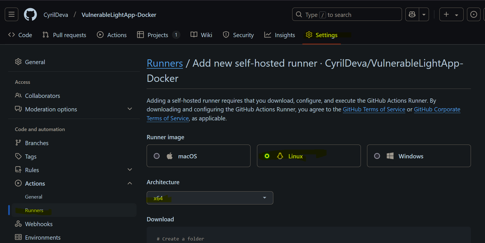
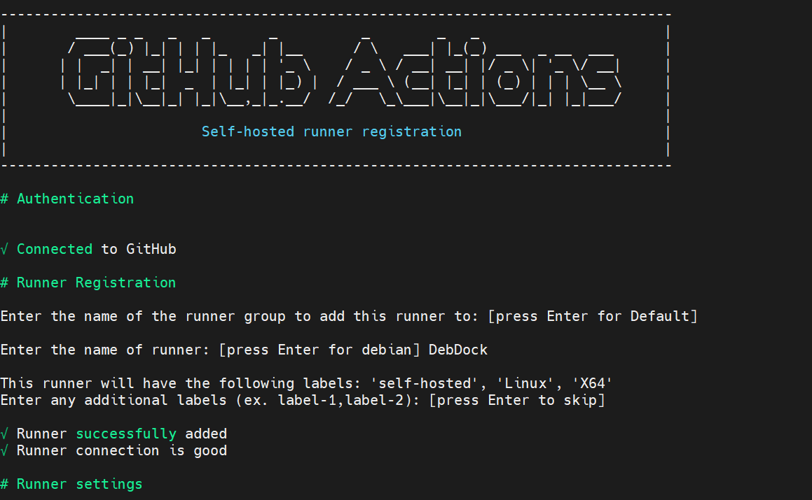
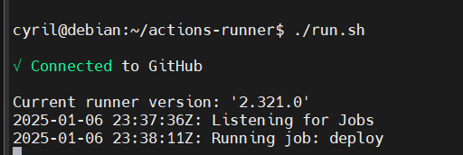
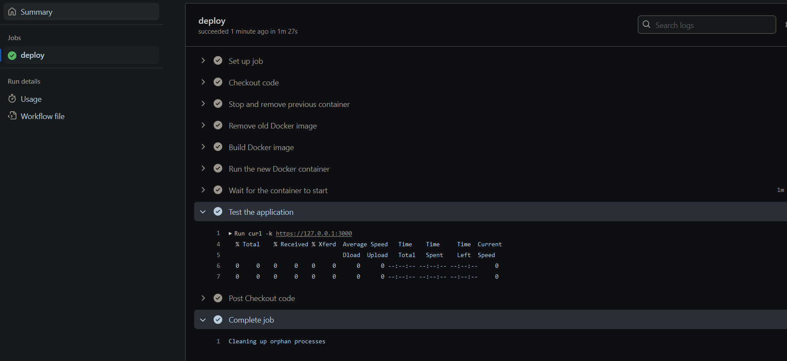

# Definitions

## CI/CD
La méthode CI/CD permet d’automatiser les étapes de développement d’applications, notamment l’intégration, l’offre et le déploiement en continu. Elle s’appuie sur l’automatisation pour résoudre les problèmes d’intégration et modifier le code rapidement et de manière fiable, ce qui facilite la collaboration entre les équipes de développement et des opérations.

## Runner
Un runner est un serveur, une machine virtuel qui est liée à GitHub pour pouvoir y executer des GitHub Action.

# Installation
## Self-hosted Runner
### Prérequis
Préparer une machine pour le runner.
Assurez-vous que la machine dispose des prérequis :
   - Système d’exploitation : Debian
   - Système à jours et Docker installé

### Créer un runner sur GitHub

Connectez-vous à GitHub et allez dans le dépôt concerné.
Naviguez vers **Settings > Actions > Runners.**

Cliquez sur New self-hosted runner et sélectionnez le système d’exploitation de votre machine.



Suivez les instructions affichées par GitHub



Démarrer le runner
`./run.sh`

Pour un démarrage automatique, configurez le service :

`sudo ./svc.sh install`

`sudo ./svc.sh start`



Le runner attend maintenant des jobs.

# Création du workflow
Creer un fichier runner.yml dans .github/workflows/

```name: Deploy vulnerablelightapp

on:
  push:
    branches: [ "main" ]

jobs:
  deploy:
    runs-on: self-hosted

    steps:
    # Checkout the repository
    - name: Checkout code
      uses: actions/checkout@v4

    # Stop and remove the previous container
    - name: Stop and remove previous container
      run: |
        docker stop vulnerablelightapp || true
        docker rm vulnerablelightapp || true

    # Remove the old Docker image
    - name: Remove old Docker image
      run: |
        docker rmi vulnerablelightapp:latest || true

    # Build the new Docker image
    - name: Build Docker image
      run: docker build -t vulnerablelightapp:latest .

    # Run the new container
    - name: Run the new Docker container
      run: |
        docker run -d --name vulnerablelightapp -p 3000:3000 vulnerablelightapp:latest

    # Wait for the container to start
    - name: Wait for the container to start
      run: sleep 66

    # Test the application
    - name: Test the application
      run: curl -k https://127.0.0.1:3000
```

Ce workflow est déclenché automatiquement lorsqu'une modification (un "push") est effectuée sur la branche main.

L'action actions/checkout@v4 est une action officielle de GitHub pour cloner le dépôt.

# Verification du status des jobs
Sur GitHub, dans l'onglet Action, tout les workflows seront affiché avec leur status (OK, Failed)


On peut y voir les details des logs de chaque actions réalisé.
